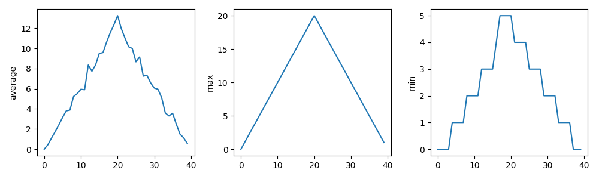

:::::::::::::::::::::::::::::::::::::: questions 

- What example code will we use for the lesson?
- How do we set up the Python package prerequisites to run the code?

::::::::::::::::::::::::::::::::::::::::::::::::

::::::::::::::::::::::::::::::::::::: objectives

- Obtain the example code used for this lesson
- Create a virtual environment to hold the Python packages needed to run the code
- Open and run the example code within VSCode

::::::::::::::::::::::::::::::::::::::::::::::::

## Obtaining Example Code

For this lesson we'll be using some example code available on GitHub,
which we'll clone onto our machines using the Bash shell.
So firstly open a Bash shell (via Git Bash in Windows or Terminal on a Mac). Then, on the command line, navigate to where you'd like the example code to reside,
and use Git to clone it.
For example, to clone the repository in our home directory,
and change our directory to the repository contents:

```bash
cd
git clone https://github.com/Southampton-RSG-Training/ai-tools-example
cd ai-tools-example
```

## Setting up a Virtual Environment

The existing code needs the NumPy and Matplotlib packages in order to run.
Let's now create a Python virtual environment and install them.
Make sure you're in the root directory of the repository, then type

```bash
python3 -m venv venv
```

Once created, we can *activate* it so it's the one in use:

```bash
[Linux] source venv/bin/activate
[Mac] source venv/bin/activate
[Windows] source venv/Scripts/activate
```

Once activated, install the needed packages:

```bash
python3 -m pip install numpy matplotlib
```


## Examining the Repository

Next, let's take a look at the contents of the repository by opening the repository directory within VSCode.
You can do this in a couple of ways, either:

1. Select the `Source control` icon from the middle of the icons on the left navigation bar. You should see an `Open Folder` option, so select that.
1. Select the `File` option from the top menu bar, and select `Open Folder...`.

In either case, you should then be able to use the file browser to locate the directory with the files you just extracted, and then select `Open`.
Note that we're looking for the *folder* that contains the files, not a specific file.

You may be presented with a window asking whether you trust the authors of this code.
In general, it's a good idea to be at least a little wary, since you're obtaining code from the internet, so be sure to check your sources!

We also need to configure the Python extension within this workspace to use the Python contained with the virtual environment we created earlier.
VSCode has a sophisticated method to access it's inner functionality known as the Command Palette, which we'll use to address this.

1. Select `View` and `Command Palette` from the VSCode menu
1. Begin typing `Python: Select Interpreter`, and then select it when it appears
1. A list of available Python installations should appear. Look for and select the one that says `./venv/bin/python` (our virtual environment)

Once selected, the default Python interpreter for VSCode will be configured.

So far within VSCode we have downloaded some code from a repository and opened a folder.
Whenever we open a folder in VSCode, this is referred to as a "Workspace" - essentially, a collection of a project's files and directories.
So within this workspace, you'll see the following:

- `data/` - a directory containing some example CSV files, each representing inflammation data from a series of hypothetical clinical trials for 60 patients over 40 days
- `.gitignore` - a text file that contains things that shouldn't be tracked by Git version control
- `inflammation-plot.py` - which plots three graphs of the mean, maximum, and minimum values for each day of a trial for all patients

You'll also see `venv/` which is not part of the repository, but the virtual environment we created and configured earlier.

## Examining the Code

Select the `inflammation-plot.py` file in the explorer window, which will bring up the contents of the file in the code editor.

```python
import glob

import numpy as np
from matplotlib import pyplot as plt

filenames = glob.glob('data/inflammation-*.csv')
filenames.sort()

for filename in filenames:
    print(filename)

    data = np.loadtxt(fname=filename, delimiter=',')

    fig = plt.figure(figsize=(10.0, 3.0))

    axes1 = fig.add_subplot(1, 3, 1)
    axes2 = fig.add_subplot(1, 3, 2)
    axes3 = fig.add_subplot(1, 3, 3)

    axes1.set_ylabel('average')
    axes1.plot(data.mean(axis=0))

    axes2.set_ylabel('max')
    axes2.plot(data.max(axis=0))

    axes3.set_ylabel('min')
    axes3.plot(data.min(axis=0))

    fig.tight_layout()
    fig.savefig(filename + '.png')
```

We'll be using this code example throughout the session.
Note that as an example, the code is deliberately written to have flaws.
Things like the line spacing is inconsistent, there are no code comments, there's some code duplication, and you may spot other issues too.
It's also deliberately been kept relatively simple.
This is for two reasons:

- Most importantly, from a training perspective, when we use Copilot later to suggest changes, we'll be able to quickly reason about the changes and how they impact the codebase
- To give us enough scope to improve it

But in essence, the code is designed to do the following:

- Loop through a list of all inflammation data files (sorted by their filename) in the `data/` subdirectory
- For each file, load the data into a Numpy array
- For that array, create a plot containing three graphs, one for each of the mean, minimum and maximum of the data
- Save the plot image to a file (essentially the same path and filename, with a `.png` added to it)


## Running the Example Code

Next, you may recall we needed NumPy and Matplotlib to run this code;
if you look at the the bottom right of VSCode's status bar, it should mention the version of Python being used, e.g. `3.14.2 (venv)`.
So here, we can see that VSCode has picked up our virtual environment we configured earlier and will use that by default.

Then, select the "Play"-looking icon at the top right of the code editor.

You should see the program run in a terminal window that appears at the bottom,
along with the following output from the program:

```output
data/inflammation-01.csv
data/inflammation-02.csv
data/inflammation-03.csv
data/inflammation-04.csv
data/inflammation-05.csv
data/inflammation-06.csv
data/inflammation-07.csv
data/inflammation-08.csv
data/inflammation-09.csv
data/inflammation-10.csv
data/inflammation-11.csv
data/inflammation-12.csv
```

After it's completed, we should see corresponding plot image files in the data directory,
essentially each with a `.png` on the end.
For example, `inflammation-01.csv.png` looks like:



::::::::::::::::::::::::::::::::: callout

## Error: `the term conda is not recognised`

If you're running an Anaconda distribution of Python on Windows,
if you see this error it means that VSCode is not looking in the right place for Anaconda's installation.
In this case, you may need to configure VSCode accordingly:

1. Activate the Command Palette, either by selecting `View` and `Command Palette` in the menu, or by pressing `Ctrl` + `Shift` + `P` (Linux), `Mac/Windows Key` + `Shift` + `P` (Mac/Windows) simultaneously
1. Type `Terminal: Select Default Profile`
1. From the options, select the entry that's something like `Command Prompt C:\WINDOWS\...`

Hopefully that should resolve the issue.

:::::::::::::::::::::::::::::::::::::::::


::::::::::::::::::::::::::::::::::::: keypoints 

- The example Python code generates a basic set of statistical plots for all data files within the `data/` directory.
- The code has a number of deliberate issues that we want to resolve throughout this lesson using GitHub Copilot.

::::::::::::::::::::::::::::::::::::::::::::::::
