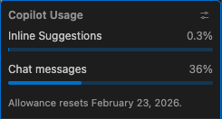

:::::::::::::::::::::::::::::::::::::: questions 

- How should I configure AI coding assistants to protect privacy and intellectual property?
- How can AI help me understand an unfamiliar codebase?
- Which AI assistant mode should I use for a particular task?
- How can I use AI to investigate software architecture, dependencies, and implementation details?
- How can I customise AI coding assistants to follow project conventions and standards?

::::::::::::::::::::::::::::::::::::::::::::::::

::::::::::::::::::::::::::::::::::::: objectives

- Configure AI coding assistants to protect privacy and intellectual property.
- Use AI assistants to understand an unfamiliar codebase.
- Construct effective prompts and manage context to improve AI responses.
- Explain the non-deterministic nature and limitations of AI-generated outputs.
- Customise an AI coding assistant to follow project conventions and standards.
- Critically evaluate AI-generated explanations and code recommendations.
- Use an AI assistants to identify opportunities for code improvement and refactoring.

::::::::::::::::::::::::::::::::::::::::::::::::

## Decide on Copilot Privacy Settings

Since Copilot's VSCode configuration inherits from GitHub's configuration,
as a first step we can and should decide and configure a suitable level of privacy for how Copilot will operate;
particularly if we are making use of sensitive or otherwise confidential data within our codebase.

We can set this within our GitHub user settings, which will apply to all we do with Copilot.
Using a browser, go to [github.com](github.com), and then:

1. Select the GitHub profile icon at github.com, and select `Copilot Settings` from the drop down menu
1. Scroll down to `Privacy`

By default, in the free tier, the two privacy options are enabled.

In general, it's a good idea to disable `Suggestions matching public code` since the risk is that it may make use of public code sources in a way that isn't properly licensed.
In addition, it's recommended to disable the other one (depending on the extent you trust GitHub and their affiliates),
since - as it clearly states - it allows GitHub and others to use your data and code snippets for product improvements.

## Asking Questions about Your Code

Attempting to understand a new codebase, whether it's your first week on a project or one you have inherited from another source, can be difficult. 
This can be due to many reasons; documentation may be incomplete, architectural decisions may be undocumented,
and the people who know the system may be unavailable or have left the organisation.

We can use Copilot to build our understanding and confidence about our codebase by asking natural-language questions about the code. It helps you:

- Build a high-level mental model of the system, which with complex codebases is often a huge task!
- Identify where key functionality is located in the code
- Understand naming conventions, patterns, and dependencies
- Reduce the cognitive load of first contact with unfamiliar code

Which sounds great, but with one critical caveat:
it's important to understand that Copilot is not an absolute source of truth,
but more of a guide to help build your own understanding of a codebase.

Let's use Copilot to help us investigate how our existing codebase works.

### Using Copilot for the First Time

Let's move over to using the VSCode chat pane on the right.
If you don't see this, select `View` from the VSCode menu and then `Chat` to display it.

You'll notice at the bottom there's a "chat" box,
with a number of selectable dropdown options below it.
You can hover over each one to discover what it is.

On the left, there's `Set Agent`, which allows you to set the mode of operation with Copilot.
Each of these modes provides an increasing degree of autonomy for Copilot to interact with your code:

- `Ask` - designed for learning and orienting yourself with existing code without changing it.
- `Plan` - will iterate on building a plan based on a prompt, exploring the codebase and creating a recommended plan containing step-by-step instructions for what to do. It won't by itself make any changes to your codebase.
- `Agent` - the most powerful mode, which lets you specify a high-level prompt to allow Copilot at a high level of autonomy to plan changes in steps, select files, and run tools or terminal commands, iterating on code edits until it is complete.

Since we want to ask questions regarding our codebase, let's set the mode to `Ask`.

The next dropdown is the AI language model being used.
By default, this is set to `Auto` so that Copilot will decide the model.
However, for consistency in this training, let's select the entry for `Claude Haiki 4.5`.

Select the `inflammation-plot.py` file in the File Explorer.
You'll notice this appears as "context" at the top of the chat box.
Essentially, this is what we're asking questions about.

Let's now ask the very high level question: `What does this code do?`, and press enter.
You'll likely be asked whether you want to enable Claude Haiku 4.5 for all clients - select `Enable` when prompted.

You'll find the response looks something like the following:

```
This code generates visualization plots for inflammation data:

1. Loads data files: Uses glob to find all CSV files matching the pattern inflammation-*.csv in the ../data/ directory, sorts them, and limits processing to the first 3 files.

2. Processes each file: For each CSV file, it:
   - Loads the data as a NumPy array using comma delimiters
   - Creates a figure with 3 subplots arranged horizontally

3. Generates three plots showing statistical summaries across patients (rows):
   - Left plot: Average inflammation values per day
   - Middle plot: Maximum inflammation values per day
   - Right plot: Minimum inflammation values per day

4. Saves output: Each figure is saved as a PNG file with the same name as the input CSV file plus .png extension.
```

::::::::::::::::::::::::::::::::: callout

## Why Aren't I Seeing the Same Response?

You'll likely find it's not exactly the same.
Due to the ways in which LLMs process requests, based on an iterative probabilistic model,
responses based on the same question will show differences:
so essentially, AI models are *probablistic*, not *deterministic*.
This effect is often visibly compounded over time, as the probabilistic outcome of a response generates an increasingly different result.

:::::::::::::::::::::::::::::::::::::::::

## Writing Good Chat Prompts

AI tools work best with context, so it's good to be as specific and concise as possible.

It's also a good idea to provide simple questions,
so if you end up with a large question that is decomposable into separate steps,
ask each step separately and you'll typically get a better outcome.
This implies that it's good to use a logical, iterative process of using AI to assist,
using responses to simple questions to inform the next question, and so on.

There's a very useful cheat sheet developed by Northwestern University (US) Research Computing and Data Services,
which can be found in their [GitHub promptEngineering repository](https://github.com/nuitrcs/promptEngineering).
It contains tips and do and don't examples to help you formulate good prompts.

::::::::::::::::::::::::::::::::: callout

## Managing Context

To improve the specificity of a prompt, it's helpful to add as much context as you can.

To add context to a chat prompt you can type `#` followed by the context item you want to add,
such as a file, folder, tools, code elements (such as variables, functions or classes), tools, amongst others.
Then press `Tab` to confirm.
For example, we could type `#inflammation-plot.py` to ensure only responses relevant to that specific file will be generated.
We could use `#codebase` if we aren't sure which files are relevant to our question, to include all our files.
Of course, our code may make use of sensitive data files that we don't want Copilot to use, which we'll look at shortly.

Another thing to remember is how the context of each chat informs the flow of questions.
Copilot chat uses the history of a chat thread to get context about your request.
To ensure you only provide the context you want,
use separate threads for each new conversation area you wish to start,
and delete requests that are no longer relevant or otherwise not useful.

:::::::::::::::::::::::::::::::::::::::::

### Investigating our Codebase

Let's ask some questions about our codebase so we can understand the implementation,
in terms of the used components and how they work.

In the chat window, ensure that the `Claude Haiku 4.5` model is selected:

```
What are the main packages used?
```

```output
1. glob: Built-in Python module for file pattern matching
   - glob.glob() finds all files matching a wildcard pattern (inflammation-*.csv)
   - Useful for batch processing multiple files with consistent naming

2. numpy: Numerical computing library
   - np.loadtxt() loads CSV data into a NumPy array
   - data.mean(axis=0), data.max(axis=0), data.min(axis=0) compute statistics across patients (rows) for each day (columns)

3. matplotlib.pyplot: Plotting library for creating visualizations
   - plt.figure() creates a new figure window
   - fig.add_subplot() adds subplots to the figure
   - axes.set_ylabel() and axes.plot() configure and draw the plots
   - fig.tight_layout() optimizes spacing
   - fig.savefig() exports the figure as an image file

These three packages work together: glob finds the files, numpy processes the data, and matplotlib visualizes the results.
```

This is a fairly typical response, although your output will vary.

::::::::::::::::::::::::::::::::: callout

## Why Aren't I Seeing the Same Results for the Same Question for the Same Codebase?

Sometimes, you may ask the same question and get a different response,
even on the same machine in the same editor.

The reason is that LLMs are non-deterministic and probablistic:
the same question can produce different answers.
In addition to it's probablistic nature, there are other reasons for these differences:

- Context-dependent: small changes in files, cursor position, or prompt matter
- Approximate understanding: infers intent, doesn't actually "understand" the codebase
- Model changes over time: behaviour can shift as Copilot and it's underlying models are updated

:::::::::::::::::::::::::::::::::::::::::

You'll see the question is answered as a general summary, but it's volunteering other information
such as the individual library calls used and what they do.
AI tools are generally quite good at summarising existing content which is helpful to build understanding,
whether it's written text or code,
although we must be careful not to accept it entirely at face value.
Such tools often have an authoriative tone and are known to be confidentally incorrect.
Nevertheless, particularly for small to moderate sized codebases that use well-documented technologies that are well represented in their training data,
these tools tend towards being really useful.

However, let's assume we want to know more about how Matplotlib generates the plots:

```
How is Matplotlib used to generate the plots?
```

```
This script uses Matplotlib to create and save visualization plots:

1. Create a figure: plt.figure(figsize=(10.0, 3.0)) creates a new figure with dimensions 10 inches wide by 3 inches tall.

2. Add subplots: fig.add_subplot(1, 3, n) creates a grid of 1 row and 3 columns, with n specifying which subplot (1, 2, or 3):
   - axes1, axes2, axes3 are the three subplot axes objects

3. Label and plot data:
   - axes.set_ylabel() adds a label to the y-axis
   - axes.plot() draws a line plot of the data on that subplot
   - Each subplot shows a different calculation: mean(), max(), and min()

4. Layout adjustment: fig.tight_layout() automatically adjusts spacing between subplots to prevent overlap.

5. Save output: fig.savefig() saves the entire figure as a PNG image file.
```

Which is a fair summary.

Due to the ambiguous nature of language and how we specify prompts,
and the nature of how LLMs operate and generate responses,
we'll typically have overlaps in responses to multiple questions.
Again, the key is to isolate what's useful,
and drill down and be increasingly specific on questioning until we have what we need
(as we would in an a typical conversation).


## Personalising Copilot to Match our Project

### What is an Instructions File?

GitHub Copilot can be personalised by adding a instructions file to a repository that tells Copilot how you want it to behave in that project.

The file acts as persistent, project-level guidance for Copilot, covering things like:

- Preferred architecture and design patterns
- Coding style and naming conventions
- Approved or banned libraries
- Testing expectations and quality standards
- Security or safety rules
- How detailed Copilot’s answers should be

By giving Copilot this shared context it helps make its suggestions more relevant for a particular project.

It serves a similar purposes to a `CONTRIBUTING.md` file in a code repository;
it provides guidance for how suggestions, code changes and contributions should be made,
but aimed at Copilot's day-to-day decisions instead.
It does this by adding context to queries from the `.github/.copilot-instructions.md` file.

For example, if we were to ask Copilot "How should I make this code more readable?",
without instructions Copilot may suggest to:

- Rename or format variable or function names inconsistently
- Change behaviour subtly in an undesired way
- Use an indentation style that isn't typically used by team members
- Without instructions, Copilot may also introduce a new design pattern the repository doesn't use

### Create an Instructions File

Let's create an instructions file now, by invoking a Copilot command in the chat window:

```
/create-instructions in a .github/copilot-instructions.md file. Use PEP8 for Python code style. Do not modify files in the data/ directory.
```

We specify the exact location where the instructions will live,
since 

At this point, VSCode will do a number of things in order to create this file:

1. Analyse the structure and files in the workspace
1. Analyse the data directory `data/` which contains our inflammation data files
1. Create the `.github/instructions/copilot-instructions.md` file itself
1. Summarise the contents of the new instructions file
1. Provide some questions for feedback to add more specific guidance in the instructions file

Note that it may request access to run a Bash command in the `data` directory,
from which it can then ascertain the structure of the data,
which you'll have to approve.
We'll look at the contents of the file in a moment.

You may also see and need to respond to some feedback questions.

### Working with our Instructions File

You should now see a `.github/copilot-instructions.md` file appear in VSCode's file browser,
which should look something like [this one](../learners/files/copilot-instructions.md).

If you open this file now, you'll see some things to note:

- Perhaps some YAML "front matter" at the top, with a description and indicating it only applies to Python files
(it may specify this information in another way however).
- Content is highlighted with a `Keep / Undo` option.
This is VSCode's way of highlighting the changes Copilot has made as suggestions,
so that you explicitly review and approve them.
- Sections on code patterns and conventions to follow.
- A section or other stipulation on not modifying the `data/` directory.

Approve this file addition by selecting `Keep`,
and save the file.

From this starting point we are free to update this file manually as we continue to develop the code,
and this context will be used whenever we interact with Copilot.

## Obtaining Guidance on how to Improve our Code

Now have an instructions file to guide Copilot,
let's take its guidance one step further.
So far we've been asking quite specific questions about this codebase in order to learn more about it.
But let's now consider we might want to do to improve it.

::::::::::::::::::::::::::::::::: callout

## What about other Models?

So far we've only used the `Claude Haiku 4.5` model,
but there are others at time of writing selectable from the models dropdown:
essentially some variants of GPT, and a Raptor model preview.

Next to each model you'll see an `x` figure, e.g. `1x`.
This is a multiplier related to the "cost" of using this model within our quota of premium requests.
So models with a `2x` beside them will cost twice as much as one with `1x`.

It's important to be clear on the relative cost,
since our quotas will be consumed more quickly with higher cost multipliers!

:::::::::::::::::::::::::::::::::::::::::

:::::::::::::::::::::::::::::::::::::: challenge

## Asking Copilot to Suggest Improvements

5 mins.

- In the chat window, select `+` to create a new chat conversation.
- Ensure you have the `Ask` mode selected in the chat box,
and the `inflammation-plot.py` file open and selected in the code editor.
- Select the `Claude Haiku 4.5` model in the model dropdown.
- Enter `How should I refactor this code to be more modular?` into the chat.

Don't update your code with any of the suggestions just yet!

:::::::::::::::::::::::::: solution

```
Looking at your code, I can see several opportunities to improve modularity. Here's a structured refactoring approach:

1. Mixed concerns: File loading, figure creation, and plotting logic are all tangled together
1. Difficult to test: Can't easily test individual plotting functions
1. Hard to reuse: If you want to plot just mean or max, you'd need to refactor
1. No separation of I/O: File operations aren't separated from business logic

Here's how I'd reorganize it:

```

```python

from matplotlib import pyplot as plt

def load_data(filename):
    """Load inflammation data from CSV file."""
    return np.loadtxt(fname=filename, delimiter=',')

def create_figure_with_subplots():
    """Create a figure with 3 subplots for inflammation plots."""
    fig = plt.figure(figsize=(10.0, 3.0))
    axes = [
        fig.add_subplot(1, 3, 1),
        fig.add_subplot(1, 3, 2),
        fig.add_subplot(1, 3, 3)
    ]
    return fig, axes

def plot_inflammation_data(data, axes):
    """Plot mean, max, and min inflammation data on provided axes."""
    metrics = [
        ('average', data.mean(axis=0)),
        ('max', data.max(axis=0)),
        ('min', data.min(axis=0))
    ]
    
    for ax, (label, values) in zip(axes, metrics):
        ax.set_ylabel(label)
        ax.plot(values)

def process_inflammation_file(filename, output_dir='.'):
    """Process a single inflammation data file and save plot."""
    data = load_data(filename)
    fig, axes = create_figure_with_subplots()
    
    plot_inflammation_data(data, axes)
    
    fig.tight_layout()
    output_filename = f"{output_dir}/{filename}.png"
    fig.savefig(output_filename)
    plt.close(fig)  # Clean up to avoid memory issues
    
    return output_filename

def main():
    """Main entry point."""
    filenames = glob.glob('data/inflammation-*.csv')
    filenames.sort()
    
    for filename in filenames:
        print(filename)
        output_file = process_inflammation_file(filename)
        print(f"Saved: {output_file}")

if __name__ == '__main__':
    main()
```

```
Benefits of This Refactoring

- Testability: each function can be unit tested independently
- Reusability: can use plot_inflammation_data() with different data sources
- Clarity: each function has a single, clear responsibility
- Maintainability: changes to plot styling only affect plot_inflammation_data()
- Extensibility: easy to add new metrics or change output format

Further Improvements (Optional)

- Configuration: Extract hardcoded values (figsize, delimiter) to a config dict
- Error handling: Add try/except blocks around file I/O
- Logging: Replace print() with proper logging
- Type hints: Add Python type annotations for clarity
- Output directory: Make output location configurable (I've added an optional parameter)
```

:::::::::::::::::::::::::::::::::::

::::::::::::::::::::::::::::::::::::::::::::::::

## What's my Copilot Usage?

It's important to keep track of just how much of our Copilot "plan" we're using,
particularly since we're (by default) on the free tier of Copilot.
We can see an overview of what we've consumed and how much is remaining by selecting the Copilot icon
(on the left of the bell-shaped icon on the far bottom right of the status bar), e.g.



So in this case, we can see that this user has consumed 0.3% of its quota for inline suggestions (which we'll look at later),
and 36% of the chat messages quota.
This allowance resets on a monthly basis, in this case February 23 2026.

::::::::::::::::::::::::::::::::::::: keypoints 

- Configure Copilot privacy settings to disable public code suggestions and data-sharing before use.
- Use `Ask` mode to explore and understand an unfamiliar codebase without making changes.
- Copilot responses are probabilistic and non-deterministic, with the same question yielding different answers.
- Write specific, concise prompts and break complex questions into separate steps for better results.
- Use `#` to add explicit context (such as files or folders) to chat prompts.
- A `.github/copilot-instructions.md` file provides persistent project-level guidance to Copilot for things like coding style and conventions.
- Always critically evaluate AI-generated explanations and code, since they can be confidently incorrect.
- Monitor your Copilot quota, especially when using higher-cost models (marked with multipliers greater than 1x).

::::::::::::::::::::::::::::::::::::::::::::::::
