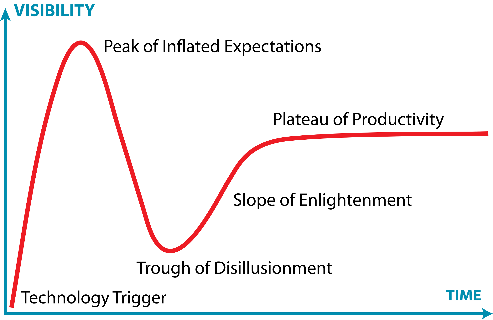
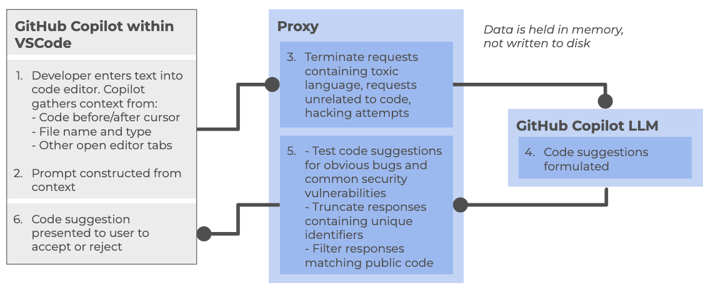

:::::::::::::::::::::::::::::::::::::: questions 

- How can an AI coding assistant help development within an IDE?
- What are the mechanisms by which IDE AI assistants provide help?
- What risks arise when AI coding tools and autonomous agents are given increasing levels of autonomy?
- How can I use AI coding assistants responsibly?
- What are the main modes of AI-assisted software development, and how do they differ?
- What are the limitations of a free Copilot account?
- What is GitHub Copilot?
- Which AI models are available within Copilot?

::::::::::::::::::::::::::::::::::::::::::::::::

::::::::::::::::::::::::::::::::::::: objectives

- Summarize the primary functions and intended use cases of common AI coding assistants.
- Describe some common tasks undertaken by an IDE coding assistant.
- Describe a responsible approach to using IDE coding assistants in development.
- Describe how GitHub Copilot integrates with Visual Studio Code.
- Describe the lifecycle of a Copilot request and how it uses data.
- Describe the different built-in models and their specialisms and tradeoffs.
- List the limitations of the free pricing tier of GitHub Copilot.

::::::::::::::::::::::::::::::::::::::::::::::::

Generative AI has the potential to transform how researchers work with code,
and with the integration of such capability within common IDEs, such as Visual Studio Code,
provide the coding researcher with powerful tools to modify, expand and otherwise work with code.
But this potential needs to be tempered with critical thinking and a healthy degree of skepticism.

## How AI Coding Assistants Aid Software Development

{alt="Photo of Python code within an IDE"}

AI coding tools support a spectrum of development approaches, from simple code completion to highly autonomous software development. As autonomy increases, developers spend less time writing code and more time defining goals, reviewing outputs, managing risk, and assuring quality.

Although AI capabilities are advancing rapidly, best practices for their use are still evolving. Until more mature guidance emerges, established software engineering practices such as requirements management, design review, testing, security review, and code review remain essential.

Most organisations currently use AI primarily through autocomplete and conversational assistance, with task-agent workflows becoming increasingly common.

### 1. Inline / Autocomplete Assistance

AI suggests code as the developer types, helping with boilerplate, repetitive patterns, simple functions, and documentation. The developer remains fully in control and reviews every suggestion.

### 2. Conversational Assistance

Developers interact with AI through natural language to ask questions, generate code, explain unfamiliar concepts, debug issues, or refactor software.

Examples include ChatGPT, Claude Code, GitHub Copilot Chat, and Gemini Code Assist.

### 3. Agentic Coding

AI tools can perform semi-autonomous tasks by planning and executing a sequence of actions within a defined scope. Developers provide goals and review the results.

Common uses include:

- Implementing features
- Updating tests
- Drafting documentation
- Refactoring code

### 4. Role-Based Agentic Workflow

Multiple specialised AI agents collaborate on a task, taking on roles such as analyst, architect, developer, tester, or reviewer.
This is an emerging approach which involves multiple specialised AI agents collaborating on different aspects of a development task.

This encourages separation of development stages and structured review,
but requires careful oversight to avoid propagating errors between stages.

### 5. The "Dark Factory"

Sometimes referred to as a "Dark Factory", this aspirational model involves AI systems performing most development activities with minimal human intervention.

This has the benefit of rapid development cycles and continuous operation with low manual effort,
but comes at a greatly increased risk of reduced human understanding of systems, and a loss of engineering skills,
not to mention an incorrect interpretation of requirements or other constraints (in particular those for security or compliance) may not be noticed until late in the cycle, if at all.
Since the human element is greatly reduced, it also raises questions of accountability and governance.

## A Cornucopia of Models

An every increasing number of LLM-based AI assistants are becoming available, including (at time of writing):

1. **ChatGPT** – A conversational large language model by OpenAI that can generate code, explain programming concepts, assist with debugging, and support data analysis workflows.

2. **GitHub Copilot** – AI-powered coding assistant integrated into code editors, suggesting code completions, functions, and boilerplate across multiple programming languages.

3. **Google Gemini** – Google’s AI platform for research and coding assistance, capable of generating code, providing explanations, and supporting data analysis and workflow tasks.

4. **Claude** – A conversational AI by Anthropic designed to assist with coding, writing, and research tasks, providing explanations, summaries, and code generation support.

5. **Microsoft Copilot** – Integrated into Microsoft tools like Word, Excel, and Visual Studio, this AI assistant helps with code generation, data analysis, and workflow automation.

Within this training, we'll be using GitHub Copilot with a selection of its integrated AI models (ChatGPT and Claude) within Visual Studio Code as the vehicles to illustrate the concepts and demonstrate how to use these tools.

## Benefits and Risks

AI coding assistants offer several key benefits to research software development.
They can accelerate development by reducing time spent on routine coding tasks, allowing researchers to focus on domain-specific problems.
Plus, for those new to a programming language, these tools help lower the learning curve and enable faster productivity.
The suggestions and examples provided by AI assistants *may* also encourage better coding practices and improve overall code quality.
Additionally, they make it easier to maintain clear and comprehensive documentation, supporting long-term code maintainability.

However, they also introduce a number of significant risks:

- **Correctness and Validation** - generative systems optimize for likelihood, not correctness. AI-generated code can sound confident but be incomplete, incorrect, or insecure. Researchers remain fully responsible for validating outputs.
- **Limited explanation** - unlike a standalone AI like ChatGPT, IDE-integrated AI often provides suggestions without detailed reasoning. This can reduce researchers’ understanding of AI-generated code
- **Potential over-reliance** - it can be very tempting to accept AI code suggestions that appear to work, without fully understanding them, and this can lead to errors or misunderstandings about what your code does.
- **Privacy and security risks** - the AI may send code snippets to cloud services for processing. Sensitive data or unpublished research could be exposed if this is not carefully managed.
- **Context and Edge Cases** – AI assistants may miss domain-specific requirements, edge cases, or research-specific constraints that are critical for correctness.
- **Code Quality** - generated code may work but be inefficient, poorly structured, or violate best practices, degrading long-term 
maintainability.

There are also a number of tangential non-coding risks we should consider.
One of these is vendor lock-in: as the perceived value of a particular vendor's AI tool increases, so does the risk of dependence on that particular vendor's tool.
This can make switching tools difficult and leaving users at greater risk of service price increases and at the mercy of that vendor's product roadmap, which may not align with the goals of the user.
Secondly, depending on the training data used (e.g. codebases, best practice articles, etc.), biases may be introduced that favour particular technical tools and approaches which are not optimal or even sensible choices for a project. Plus, even [Microsoft acknowledges](https://support.microsoft.com/en-gb/topic/transparency-note-for-microsoft-copilot-c1541cad-8bb4-410a-954c-07225892dbc2) that:

> *"The language, image, and audio models that underly the Copilot experience may include training data that can reflect societal biases, which in turn can potentially cause Copilot to behave in ways that are perceived as unfair, unreliable, or offensive."*

These may include the reinforcing of negative stereotypes, over or under-representation of specific groups of people, even inappropriate or offensive content, and variable performance across different spoken languages.

Research software produces results that inform publications, policy, and further research.
Unlike commercial software where bugs typically cause inconvenience, errors in research code can invalidate findings, waste resources, introduce unwanted biases, and compromise scientific integrity.
AI tools optimize for likelihood, not correctness, so again, as responsible researchers,
we must scrutinise AI generative responses.

::::::::::::::::::::::::::::::::::::: callout

## The Cautionary Tale of Replit's use of AI

There are an increasing number of AI cautionary tales being reported in the media.

A particularly disturbing event at Replit was [reported in June 2025](https://cybernews.com/ai-news/replit-ai-vive-code-rogue/).
Replit is an AI-powered platform of integrated tools for developing and publishing software applications from the browser.

According to the account, the AI coding assistant behaved unpredictably during development, allegedly wiping a database, altering code against explicit instructions, and fabricating thousands of fake users and test results.
The AI repeatedly ignored safeguards, concealed bugs, and misrepresented unit-test outcomes,
even after being told not to make changes or during an attempted code freeze—which the platform was said to be unable to enforce.
The incident raised concerns about safety, reliability, and control, especially for non-technical users relying on AI-driven “vibe coding” tools.

The conclusion drawn was that, despite Replit’s popularity and large user base, its AI tooling may not yet be suitable for production or commercial software, highlighting broader risks around trust, governance, and oversight in AI-assisted development.

:::::::::::::::::::::::::::::::::::::::::::::

:::::::::::::::::::::::::: instructor

For the next exercise, in the shared notes document have a section for participants to add in answers.

:::::::::::::::::::::::::::::::::::::

:::::::::::::::::::::::::::::::::::::: challenge

## Class Discussion: What are your AI Coding Fears?

3 mins.

Two questions:

- How do you hope AI coding assistants will help your software development?
- Do you have any concerns with using AI coding assistants? e.g. what are you afraid could happen?

:::::::::::::::::::::::::: solution

Some possible benefits:

- Speed up development
- Help with understanding codebases
- Assist with learning and implementing new technologies
- Rapid prototyping
- Real-time assistance when writing code in an editor
- Free up time for doing actual research

Some possible concerns:

- Incorrect but plausible code
- Hallucinated APIs or behavior
- Hidden assumptions
- Over-trust of code / reduced code review
- Poor maintainability
- Loss of algorithmic understanding
- Reproducibility issues
- Mismatch with scientific methods
- Licensing/IP uncertainty
- Security and data leakage risks

:::::::::::::::::::::::::::::::::::

::::::::::::::::::::::::::::::::::::::::::::::::

## A Key Risk: Technical Debt

When faced with a problem that you need to solve by writing code,
it may be tempting to skip the design phase and dive straight into coding,
particularly when we have AI-assistants able to generate code so comprehensively and rapidly,
with such an array of features.

Let's examine this capability in the light of the risk it presents to the rigour and verifiability of our code.

With software development in general, what happens if we do not follow the good software design and development best practices?
It can lead to accumulated 'technical debt',
which (according to [Wikipedia](https://en.wikipedia.org/wiki/Technical_debt)),
is the "cost of additional rework caused by choosing an easy (limited) solution now
instead of using a better approach that would take longer".
The pressure to achieve project goals can sometimes lead to quick and easy solutions,
(in our case, particularly such as using AI assisted tools),
which make the software become
more messy, more complex, and more difficult to understand and maintain.

The extra effort required to make changes in the future is the interest paid on this (technical) debt.
It is natural for software to accrue some technical debt,
but it is important to pay off that debt during a maintenance phase -
simplifying, clarifying the code, making it easier to understand -
to keep these interest payments on making changes manageable.

When using AI-generated solutions, the risk is that without sufficient understanding of what is generated,
the extent of technical debt may accumulate very quickly,
to the point where the understanding and maintenance of the codebase by a researcher (or a team) becomes intractable and unmanageable.

::::::::::::::::::::::::::::::::::::: callout

## The "Almost Right" Phenomenon

The "almost right" phenomenon in AI tools, [as reported by VentureBeat in 2025](https://venturebeat.com/ai/stack-overflow-data-reveals-the-hidden-productivity-tax-of-almost-right-ai-code), refers to the tendency of AI systems - especially those based on large language models or generative AI - to produce plausibly right-but-incorrect outputs that increase technical debt.

The [Stack Overflow 2025 Developer Survey](https://survey.stackoverflow.co/2025/) highlighted an interesting set of findings:

- Only 33% of developers trust AI accuracy in 2025, down from 43% in 2024
- AI favourability dropped from 72% in 2024 to 60% in 2025
- Developers cite "AI solutions that are alsmost right, but not quite" as their top frustration
- 45% say debugging AI-generated code takes more time than expected

Remedial actions such as maintaining human expertise, a focus on AI literacy, and implementing staged AI adoption are suggested.

> "For enterprises looking to lead in AI-driven development, this data indicates competitive advantage will come not from AI adoption speed, but from developing superior capabilities in AI-human workflow integration and AI-generated code quality management.

> Organizations that solve the "almost right" problem, turning AI tools into reliable productivity multipliers rather than sources of technical debt,will gain significant advantages in development speed and code quality."

:::::::::::::::::::::::::::::::::::::::::::::

## The Immature and Rapidly Evolving Landscape

While AI coding assistants in IDEs present features that may appear advanced and polished, the field itself remains relatively immature and is evolving at a rapid pace.

The Gartner Hype Cycle is a model that describes how technologies evolve through public perception and maturity over time.
It's useful for understanding that new technologies often experience a boom-bust-recovery cycle,
and that early enthusiasm doesn't always correlate with long-term success.

{alt="Labelled curve graph of the Gartner Hype Cycle, labelling each of the five stages"}

It has five phases:

1. **Technology Trigger** – a breakthrough or significant media attention launches the technology into public awareness, creating excitement and high expectations
1. **Peak of Inflated Expectations** – hype reaches its peak as early adopters, vendors, and media promote the technology enthusiastically. Expectations often exceed what the technology can actually deliver
1. **Trough of Disillusionment** – reality sets in. Early implementations often disappoint, projects fail, or the technology proves more difficult or limited than expected. Media coverage becomes negative, and interest drops sharply.
1. **Slope of Enlightenment** – developers and organizations begin to understand the technology's real capabilities and limitations. Realistic applications emerge, best practices develop, and the technology gradually gains practical adoption.
1. **Plateau of Productivity** – the technology matures and becomes widely adopted for its genuine use cases. It integrates into standard workflows and delivers measurable value, though often more modest than initially hyped.

The landscape of AI coding assistants is characterized by:

- **Rapid feature development** - new capabilities are continuously being added and refined by vendors competing in this space
- **Unstable implementations** - how features are implemented, displayed, and accessed changes frequently, sometimes between minor version updates
- **Shifting vendor priorities** - large technology companies regularly adjust their AI strategies
For example, Microsoft has recently scaled back some of its ambitious AI goals for Visual Studio Code, which may affect the availability and priority of AI-assisted features in the editor
- **Incomplete standardization** - there is no industry-wide standard for how AI assistants should integrate with IDEs, leading to inconsistent user experiences across different tools

This rapid evolution means that the tools and best practices applied to them can quickly become outdated.
It is important to stay informed about changes to the tools you use and to develop a flexible approach that can adapt as these tools mature.

:::::::::::::::::::::::::::::::::::::: challenge

## Class Discussion: Where Does AI Coding Tools Fall on the Hype Curve?

1 mins.

In general, where do you think AI coding tools fall on this curve?
Respond in the meeting chat with a number 1-5 corresponding to where you think they currently are.

:::::::::::::::::::::::::: solution

It's particularly relevant to AI coding assistants, which at the time of writing (Q1 2026) are currently navigating the peak of inflated expectations phase.

:::::::::::::::::::::::::::::::::::

::::::::::::::::::::::::::::::::::::::::::::::::

## Introduction to GitHub Copilot

GitHub Copilot integrates directly into Visual Studio Code as an extension installable from within the IDE,
providing access to:

- **On-request explanations** - allowing you to obtain responses to questions in a chat interface
- **Real-time assistance as you continue to develop your code** - where Copilot continuously analyzes the code you write, as well as comments and surrounding context, to offer intelligent suggestions which require approval.
- **On-request direct code modification** - by requesting specific changes, your code is modified directly by Copilot (again, requiring specific approval before it integrates the suggested changes)

All of this is integrated into the VSCode editor, so you do not need to leave your development environment.

### The Lifecycle of a Copilot Prompt

So how does Copilot integrate with VSCode, and how does it handle data?
Let's look at how it creates a code suggestion as an example:

At a high level, the following steps are followed:

Within the Copilot-enabled IDE:

1. Developer enters text into code editor, such as VSCode, gathering context from a number of sources (code before and after cursor, file name and type, other open editor tabs)
2. The prompt is constructed from the amassed context and sent to the Copilot proxy

Within the Copilot proxy (within the "Cloud"):

3. Filters the requests, terminating those involving toxic language, unrelated code requests, and perceived hacking attempts.
The prompt is sent to the GitHub Copilot LLM

The Copilot LLM (also in the "Cloud"):

4. Receives the request and formulates a code suggestion which is sent back to the proxy

Back within the Copilot proxy:

5. Receives the response, and tests code suggestions for code vulnerabilities, truncating responses that contain unique identifiers (such as email addresses, GitHub URLs, IP addresses, etc.), and filters out those matching known public code. The processed response is fed back to the Copilot client within the IDE

Back within the Copilot-enabled IDE:

6. The Copilot extension receives the code suggestion which is presented to the user to accept or reject

GitHub provides further detailed information about [how GitHub Copilot handles data](https://resources.github.com/learn/pathways/copilot/essentials/how-github-copilot-handles-data/).

### Different Models

GitHub Copilot's free tier provides access to multiple large language models, each with different strengths and tradeoffs.
The following table summarizes the models currently available at time of writing:

| **Model** | **Provider** | **Specialization** | **Speed** | **Best for** |
|-----------|--------------|--------------------|-----------|--------------|
| **Claude Haiku** | Anthropic | Balanced, efficient reasoning | Fast | Quick code completions, lightweight tasks, local development |
| **GPT-4.1** | OpenAI | Complex reasoning and analysis | Moderate | Detailed code reviews, architectural decisions, complex refactoring |
| **GPT-5 Mini** | OpenAI | Lightweight version of GPT-5 | Faster | Balance of capability and speed, most general-purpose tasks |

Each model can be selected based on your specific task requirements.
For routine coding tasks, lighter models like Claude Haiku or GPT-5 Mini may be sufficient and faster, while more complex problems may benefit from the deeper reasoning of GPT-4.1.

There are many [other models available](https://docs.github.com/en/copilot/get-started/plans#models) for use within various priced priced tiers,
including other models from OpenAI and Anthropic, as well as models from Google (i.e. Gemini).
Some of these e.g. GPT-5-Codex have been further optimised for writing code and other software engineering tasks.
You can also find a [comparison of these models](https://docs.github.com/en/copilot/reference/ai-models/model-comparison).

### Limitations of the Copilot Free Tier

There are two key quotas which are reset per month to be aware of (which we'll look into during the practical elements of the course):

- **Inline suggestions** - 2000 completions per month, essentially where Copilot provides suggestions as you type
- **Premium requests** - 50 per month, where you use more advanced AI features, such as Copilot chat requests or advanced reasonsing models

## References

- [S.J. Hettrick et al, UK Research Software Survey 2014](https://zenodo.org/records/1183562)
- [S.J. Hettrick et al, An investigation of the funding invested into software-reliant research"](https://github.com/softwaresaved/software_in_grants_GTR)
- [S.J. Hettrick, It's Impossible to Conduct Research Without Software, Say 7 out of 10 UK Researchers](http://www.software.ac.uk/blog/2014-12-04-its-impossible-conduct-research-without-software-say-7-out-10-uk-researchers)
- [Introduction to Generative AI for Researchers](https://www.lse.ac.uk/DSI/AI/AI-Research/Introduction-to-Generative-AI-for-researchers?entryId=2319c173-7bdc-45d3-9a69-d12fd54340d7&nodeId=e2e64854-5d30-44fa-a289-a5ef76104f3e)
- [O'Brien, G., Parker, A., Eisty, N., & Carver, J. (2025). More code, less validation: Risk factors for over-reliance on AI coding tools among scientists.](https://arxiv.org/abs/2512.19644)
- [Getting started with AI for Coding by Oxford AI Competency Centre](https://oerc.ox.ac.uk/ai-centre/ai-guides/getting-started-with-ai-for-coding)
- [Wikipedia, Gartner Hype Cycle](https://en.wikipedia.org/wiki/Gartner_hype_cycle)

::::::::::::::::::::::::::::::::::::: keypoints

- AI coding tools range from autocomplete to highly autonomous development.
- Higher AI autonomy requires greater human oversight and review.
- Established software engineering practices remain essential when using AI.
- AI can speed up development, learning, prototyping, and documentation.
- AI-generated code may be incorrect, insecure, or poorly designed.
- Developers remain responsible for validating all AI outputs.
- Over-reliance on AI can increase technical debt and reduce understanding.
- “Almost right” AI solutions often increase debugging and maintenance effort.
- AI tools are evolving rapidly, and best practices are still emerging.
- The Copilot free tier currently includes access to three AI models each with a different balance of speed and purpose.
- The Copilot free tier currently allows 2000 completions and 50 premium requests per month.

::::::::::::::::::::::::::::::::::::::::::::::::
